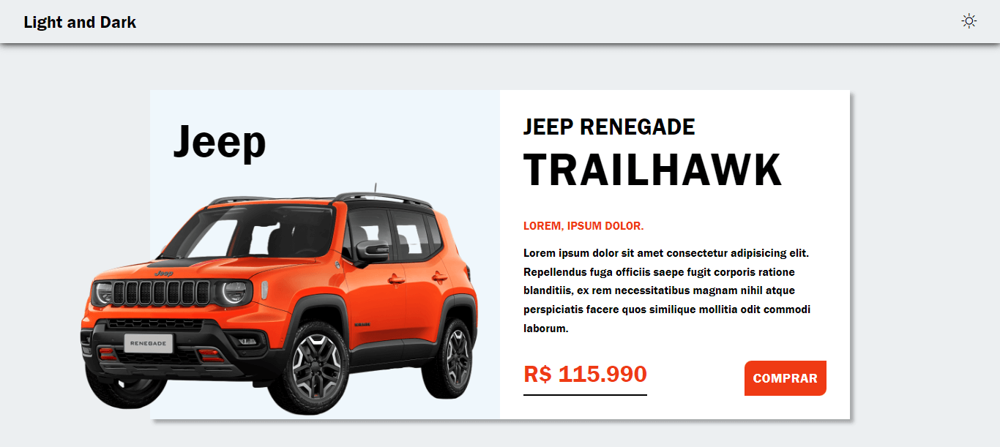
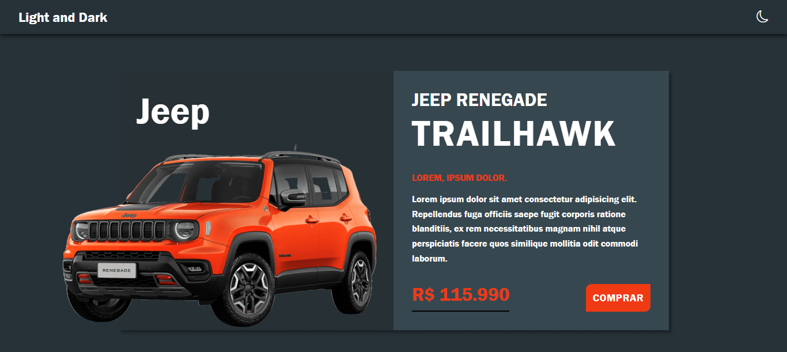

<h1 align="center">
  Tema Claro e Escuro
</h1>

  

  

## Projeto - Tema Claro e Escuro

Este projeto demonstra modos de tema claro e escuro em uma landing page. Possui uma estrutura organizada, design atraente e total responsividade, aderindo a práticas de código limpo.

Tecnologias Utilizadas:
* [HTML (Linguagem de marcação):](https://www.w3schools.com/html/html_intro.asp) Utilizado para estruturar e definir o conteúdo da página, incluindo cabeçalhos, parágrafos, listas e imagens.
* [CSS (Folha de estilos em cascata):](https://www.w3schools.com/css/css_intro.asp) Utilizado para estilizar os elementos da página, definindo cores, tamanhos, fontes e layout, proporcionando uma aparência visualmente atraente.
* [JavaScript:](https://developer.mozilla.org/pt-BR/docs/Web/JavaScript) Utilizado para adicionar interatividade à página, permitindo que o usuário selecione personagens e exiba informações dinamicamente.
* [Bootstrap Icons:](https://icons.getbootstrap.com/) É um conjunto de ícones pronto para uso em projetos web e aplicativos, facilitando a adição de elementos visuais de maneira consistente e responsiva.
* [TinyJPG](https://tinyjpg.com/) e [TinyPNG:](https://tinypng.com/) O site utilizado é uma ferramenta online que comprime imagens JPEG e PNG sem perder muita qualidade. Ele reduz o tamanho dos arquivos de imagem usando algoritmos eficientes de compressão.

Créditos:
* Criado com base do Canal no YouTube | [Matheus Battisti - Hora de Codar](https://www.youtube.com/watch?v=6wd7PK3G7Zo&t=153s&ab_channel=MatheusBattisti-HoradeCodar)

Implantação do Projeto no Netlify: [Explore o projeto clicando aqui.](https://dark-and-light-mode-v1.netlify.app/)

---

## Project - Light and dark theme

This project demonstrates light and dark theme modes on a landing page. It has an organized structure, attractive design and full responsiveness, adhering to clean code practices.

Technologies used:
* [HTML (HyperText Markup Language):](https://www.w3schools.com/html/html_intro.asp) Used to structure and define page content, including headings, paragraphs, lists and images.
* [CSS (Cascading Style Sheets):](https://www.w3schools.com/css/css_intro.asp) Used to style the elements of the page, defining colors, sizes, fonts and layout, providing a visually appealing appearance.
* [JavaScript:](https://developer.mozilla.org/pt-BR/docs/Web/JavaScript) Used to add interactivity to the page, allowing the user to select characters and display information dynamically.
* [Bootstrap Icons:](https://icons.getbootstrap.com/) It's a set of icons ready for use in web projects and applications, making it easy to add visual elements in a consistent and responsive way.
* [TinyJPG](https://tinyjpg.com/) e [TinyPNG:](https://tinypng.com/) The website used is an online tool that compresses JPEG and PNG images without losing much quality. It reduces the size of image files using efficient compression algorithms.

Credits:
* Created on the basis of the YouTube channel | [Matheus Battisti - Hora de Codar](https://www.youtube.com/watch?v=6wd7PK3G7Zo&t=153s&ab_channel=MatheusBattisti-HoradeCodar)

Project deployment on Netlify: [Explore the project by clicking here.](https://dark-and-light-mode-v1.netlify.app/)
